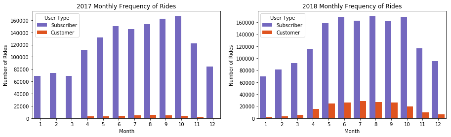
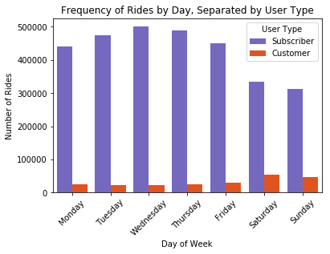
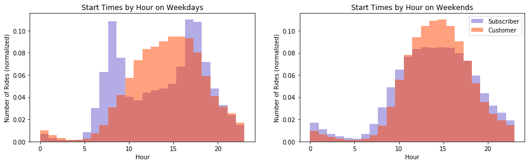
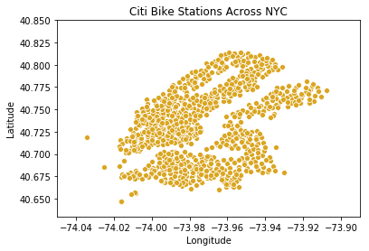
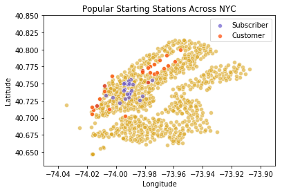
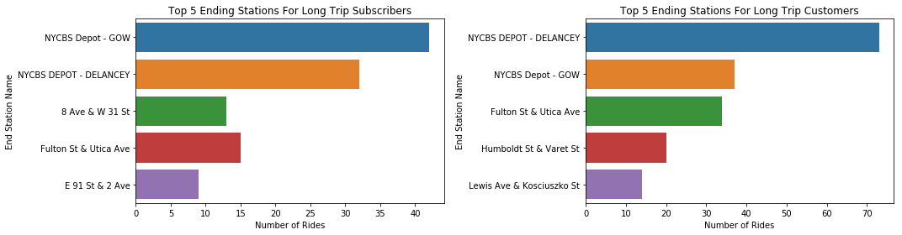

# Citi Bike Share Analytics Report 
This capstone project is my first project during in the Thinkful Data Science Bootcamp curriculum.  The purpose of this project is to ask and answer analytical questions on a dataset of our choosing.  In this case, I chose to analyze Citi Bike's dataset in New York City for the years 2017 - 2018. In the interest of helping Citi Bike (and potentially othe bike share programs) increase revenue, I explored two parts of the data:  
1.  **Time**
    1.  What time of year has more riders?
    2.  When is the most popular time to rent a bike?
2.  **Location**
    1.  Can we identify hotspots?
    2.  Can we prevent bikes from being stolen?

The data provided is as follows:

| Variable | Explanation   |
|------|------|
|   Trip Duration  | Length of the bike ride in seconds |
|   Starting and ending times and date  | Year:Month:Day  Hour:Minute:Second |
|   Start and end station names and coordinates  | Station name, station ID, latitudes and longitudes |
|   Bike ID  | |
|   Year of birth  | |
|   Gender  | 0 = Unknown, 1 = Male, 2 = Female |
|   User Type  |  Customer = 1 or 3 day pass, Subscriber = annual pass|

## 1 - Time
There are several ways to look at trends in time.  In this case, I will look at what part of the year there are more bike rides and what time of day is the most popular to rent a bike.  

### 1.1 - What Time of Year has More Riders?
There are two types of users which I will call subscribers and customers.  Subscribers are those who buy a yearly/annual pass whereas customers are those that buy a 1 or 3 day pass.  It is important to examine these two populations separately because I suspect the company can generate the most money by drawing in more customers.  Thus, I looked at the number of rides per month for 2017 and 2018 separated by user type, plotted below.  

From 2017-18, the average number of rides per month for annual subscribers increased by ~10% whereas for day pass customers, the number of rides per month increased by 520%.  This shows that growth from annual subscribers is stagnating whereas there is room for growth to draw in day pass customers.  **With focused advertising, especially before the warm summer months, it might be possible to increase the number of day pass riders for several years.**  

### 1.2 - When is the Most Popular Time to Rent a Bike?
There are two ways I interpreted 'most popular time'.  The first way is to look at what day of the week has the most bikes rented out, and the second is to look at what is the most popular hour of the day.  

Looking at the most popular day(s) of the week, I was suprirsed to see that the majority of rides came from the weekdays, specifically with a peak on Wednesday.  A breakdown of the number of rides based on user type is plotted below.  It seems that those with an annual membership ride the most during the weekday, with the average number of subscribers decreasing by ~30% on weekends.  The average number of day pass customers however increased by 100% on the weekends compared to the weekdays.  **This leads me to believe that annual subscribers are NYC locals and day pass customers are tourists.**  

To confirm that annual subscribers are locals and day pass customers are tourists, I looked at the patterns of renting bikes by time of day, shown below. On the weekdays, there are two distint patterns.  **The annual subscribers rent bikes mainly in two parts of the day, at around 8am and 5pm.  The customers however have one peak, where the number of bike rentals slowly increase starting at around 10am and peaks at 3pm before dropping off steadily.  During the weekends, both annual subscribers and annual customers have similar bike rental patterns.**  For now, I think it is safe to say that annual subscribers are NYC locals and day pass customers are NYC tourists. 

## 2 - Location
Using location data can help Citi Bike create a plan to reach a broader audience as well as keep operations running smoothly.  

### 2.1 - Can we Identify Hotspots?
The first way to use location data is to try and identify hotspots.  By hotspots, I mean places that Citi Bike riders tend to cluster around.  Before I start locating hotspots, I want to see where the docking stations are located.  To do so, I made a scatterplot of the coordinates for each station, seen below.  

What's amazing is that the number of docking stations is so dense, we are able to see geographic features of NYC through the scatterplot.  For example, we can see the East River flowing through the middle, Central Park is a blank spot near the top, and the edges above Central Park is the Hudson River that separates New York and New Jersey.  The docking stations doesn't encompass all of NYC, as south of the East River, only parts of Brooklyn is populated with stations.  

Now that we have seen where the docking stations are located, where are the most frequently visited stations?  Below are the most frequently visited stations based on user type.  **The day pass customers tended to rent bikes around Central park and the western waterfront, which are very touristy areas.  On the other hand, annual subscribers were centered around midtown Manhattan, where I'm sure is where the locals live and work.  The other thing to notice is that the stations below the East river aren't as popular.  Is there a way to increase the number of rides in these areas?**  

### 2.2 - Can we Prevent Bikes from Being Stolen?
Lastly, I wanted to see if we could use the data to identify where bikes are being stolen from.  The first step was to identify which bikes were stolen.  In this case, I'm assuming bikes that are out for 8 hours or more are stolen.  This is because sometimes, the rider doesn't dock the bike correctly so it will register as being rented out.  Just in case the rider comes back to re-dock the bike, I've given an 8 hour buffer window.  

For both annual subscribers and day pass customers, 10% of the stolen bikes ended up at 3 common stations: NYCBS Depot Gow, NYCBS Depot Delancey, and Fulton St and Utica Ave.  The bikes that ended up at NYCBS Depots in particular travelled quite far, often crossing the East River before ending up its ending station.  

Of course, there are many assumptions that went into identifying these stolen bikes.  The most glaring assumption is that these bikes were actually returned to a docking station; I'm sure the majority of stolen bikes are never recovered at all!  Ideally, the best way to identify if a bike was stolen or not was to check the bike's odometer, if it even has one.  

## 3 - Furthur Research
An interesting problem would be to track the flix of bikes in and out of stations so that the company can move bikes around to prevent stations from becoming empty or over crowded.  This involves 1) figuring out tracking number of bikes by station based on time of year/week, seasons, and special events, and 2) figuring out when to actaully move the bikes.  Does this mean moving the bikes during or around rush hour traffic?  What to routes should the driver take?  

